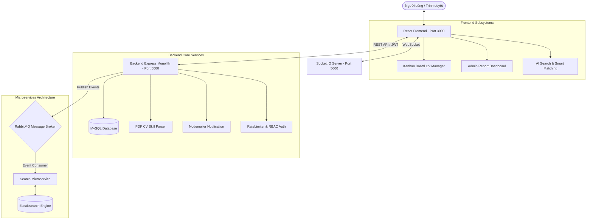

# 💼 JobFind — Nền Tảng Tuyển Dụng & Tìm Việc Làm Real-Time (Microservices & AI-Powered)


> **JobFind** là nền tảng kết nối tuyển dụng toàn diện giữa **Ứng viên**, **Nhà tuyển dụng** và **Quản trị viên**. Dự án được tích hợp giao diện UI/UX hiện đại với **Bảng Kanban kéo-thả quản lý CV**, **Hệ thống tìm kiếm AI & Microservices (Elasticsearch + RabbitMQ)**, **Chat Real-time**, **Phân tích độ khớp CV PDF** và **Báo cáo thống kê chuyên sâu (Analytics Dashboard)**.

---

## ✨ Điểm Nổi Bật & Trải Nghiệm UI/UX Toàn Diện

### 🎨 1. Giao Diện Modern UI/UX & Kanban Board Kéo-Thả
- **Bảng Kanban Quản lý Trạng Thái CV (Drag & Drop UX)**:
  - Cho phép Nhà tuyển dụng quản lý hồ sơ ứng viên theo quy trình 5 bước: *Mới nộp ➔ Sơ tuyển ➔ Phỏng vấn ➔ Trúng tuyển ➔ Từ chối*.
  - Thao tác kéo-thả (Drag & Drop) siêu mượt, tự động cập nhật trạng thái CV và gửi thông báo real-time tới ứng viên.
- **Giao diện Responsive Tối Ưu**: Đạt chuẩn UX cho mọi kích thước màn hình (Desktop, Tablet, Mobile).
- **Trải nghiệm Tìm kiếm & Lọc Thông Minh**: Bộ lọc đa tiêu chí (Ngành nghề, Cấp bậc, Mức lương, Hình thức, Địa điểm) kết hợp thanh tìm kiếm Typeahead gợi ý tức thì.

### 💬 2. Trò Chuyện Real-Time Tức Thì (Socket.IO)
- **Nhắn tin trực tiếp 1-1**: Kết nối ứng viên và đúng người phụ trách tuyển dụng của doanh nghiệp.
- **Tương tác sinh động**:
  - Chấm xanh báo trạng thái **Online / Offline**.
  - Hiệu ứng **"Đang soạn tin nhắn..." (Typing indicator)**.
  - Thông báo số tin nhắn chưa đọc (Unread badge) tự động cập nhật trên Header & Navigation Menu.
- **Cơ chế Fallback thông minh**: Tự động chuyển qua REST API nếu kết nối socket bị gián đoạn.

### 🧠 3. Chấm Điểm Khớp Skill CV & Tìm Kiếm Thông Minh bằng AI
- **Smart PDF CV Parsing**: Tự động đọc và bóc tách dữ liệu kỹ năng từ file CV dạng PDF do ứng viên tải lên.
- **Tính toán điểm số tương thích (%)**: So sánh danh sách kỹ năng trên CV với yêu cầu bài đăng để xếp hạng ứng viên phù hợp nhất.
- **AI Search Service**: Tìm kiếm công việc theo ngữ nghĩa nhu cầu thay vì chỉ khớp từ khóa đơn thuần.

### 📊 4. Phân Hệ Báo Cáo Analytics & Dashboard Admin
- **Phễu Chuyển Đổi Tuyển Dụng (Funnel Analytics)**: Thống kê tỷ lệ nộp CV, tỷ lệ đạt phỏng vấn, số lượng bài đăng active theo mốc thời gian.
- **Thống kê Doanh thu & Gói Dịch vụ**: Quản lý gói đăng tin/xem CV tích hợp thanh toán qua **PayPal Sandbox**.
- **Xuất Báo Cáo**: Hỗ trợ xuất dữ liệu thống kê ra file CSV / PDF cho quản trị viên.

### 🛡️ 5. Kiến Trúc Microservices & Bảo Mật Hệ Thống
- **Microservices Search Service**: Dịch vụ tìm kiếm độc lập chạy trên **Elasticsearch** kết hợp **RabbitMQ Event Consumer** giúp index dữ liệu việc làm tốc độ cao mà không làm chậm hệ thống chính.
- **Bảo mật Đa Lớp**: 
  - Middleware **Rate Limiting** bảo vệ API khỏi tần suất request bất thường.
  - Phân quyền người dùng dựa trên vai trò **RBAC (Role-Based Access Control)**.
  - Lưu trữ xác minh OTP (`otpStore.js`) và kiểm thử tự động với `smoke-test.js`.

---

## 🛠️ Công Nghệ Sử Dụng (Tech Stack)

### **Frontend**
- **Core**: React.js (Hooks, Context API, Redux)
- **Styling**: SCSS, Vanilla CSS, Bootstrap 4/5, FontAwesome
- **Components & UX**: Interactive Kanban Board, Custom Scrollbars, Modals
- **Real-time**: `socket.io-client`
- **Charts & Editor**: Chart.js, TinyMCE Rich Text Editor
- **Services**: `aiSearchService.js`, `applicationService.js`, `adminReportService.js`

### **Backend & Microservices**
- **Monolith Core**: Node.js, Express.js, Sequelize ORM (MySQL / MariaDB)
- **Search Microservice**: Node.js, Elasticsearch Client, RabbitMQ Consumer (`microservices/search-service`)
- **Real-time Engine**: Socket.IO (Chạy chung cổng 5000)
- **Bảo mật**: JWT (JSON Web Token), bcryptjs, Rate-Limiter, RBAC Authorization
- **File Parser & Mail**: PDF-Parse, Nodemailer

---

## 📁 Cấu Trúc Thư Mục Dự Án

```
DALN_JobFind/
├── backend/                        # REST API Node.js/Express + Sequelize ORM
│   ├── scripts/                    # Scripts khôi phục DB mẫu, create-test-accounts, smoke-test
│   ├── src/
│   │   ├── config/                 # Cấu hình Database & Socket.io
│   │   ├── controllers/            # Xử lý logic CV, Post, Chat, User, Package, Report
│   │   ├── middlewares/            # JWT Verification, Rate Limiter
│   │   ├── routes/                 # Khai báo các Route API
│   │   ├── services/               # Logic nghiệp vụ dữ liệu
│   │   └── utils/                  # Authorization, EventBus, OTP Store, Mail Template
├── frontend/                       # Giao diện React.js
│   ├── public/                     # Static assets (fonts, images, TinyMCE vendors)
│   └── src/
│       ├── components/             # React Components (Categories, FeatureJob, Modals...)
│       ├── container/              # Các trang chính (Candidate, Company, Admin System, Chat, JobPage)
│       │   └── system/Cv/          # Giao diện Kanban Board quản lý CV
│       │   └── system/Report/      # Dashboard báo cáo thống kê Analytics
│       ├── css/                    # SCSS / CSS Stylesheet dùng chung
│       ├── service/                # Gợi ý AI, Báo cáo Admin, Application Service, CV Service
│       └── socket.js               # Kết nối Socket.IO phía Client
├── microservices/                  # Kiến trúc Microservices mở rộng
│   ├── search-service/             # Tìm kiếm Elasticsearch + RabbitMQ Worker
│   └── shared/                     # Mã nguồn dùng chung (RabbitMQ Client, Event Definitions, Logger)
└── database/                       # File cơ sở dữ liệu mẫu MySQL (jobfindtest.sql)
```

---

## 📱 Luồng Kiến Trúc Hệ Thống (System Architecture)



---

## ⚡ Hướng Dẫn Cài Đặt & Chạy Dự Án

### Yêu Cầu Hệ Thống
- **Node.js**: Bản LTS (v16 trở lên)
- **Database**: MySQL / MariaDB (XAMPP / WampServer)
- **Cổng mặc định**: Backend (`5000`), Frontend (`3000`)

---

### Bước 1: Cấu hình môi trường (`.env`)

Kiểm tra file `backend/.env` (Cấu hình mặc định thích hợp với XAMPP):

```env
DB_HOST=127.0.0.1
DB_PORT=3333        # Nếu dùng MySQL chuẩn đổi thành 3306
DB_NAME=jobfindtest
DB_USER=root
DB_PASSWORD=
PORT=5000
```

---

### Bước 2: Nạp dữ liệu mẫu tự động đầy đủ

Mở Terminal tại thư mục `backend` và chạy lệnh khôi phục dữ liệu mẫu:

```powershell
cd backend
npm install
$env:CONFIRM_RESTORE_SAMPLE_DATA='true'
npm run restore:sample-data
```

> [!TIP]
> Lệnh này sẽ tạo tự động DB `jobfindtest` gồm **38 tài khoản người dùng**, **41 bài đăng tuyển dụng**, **17 công ty**, lịch sử chat mẫu, đánh giá công ty và các file CV PDF thật.

---

### Bước 3: Khởi chạy Backend API & Socket Server

```powershell
cd backend
npm start
```
*Server API và Socket.IO sẽ lắng nghe tại **`http://localhost:5000`**.*

---

### Bước 4: Khởi chạy Frontend Interface

Mở một cửa sổ Terminal mới:

```powershell
cd frontend
npm install
npm start
```

👉 TRUY CẬP ỨNG DỤNG TẠI: **`http://localhost:3000`**

---

### Bước 5: (Tùy chọn) Chạy Microservice Tìm kiếm Elasticsearch

Nếu bạn muốn chạy mô-đun Microservice Search:

```powershell
cd microservices/search-service
npm install
npm start
```

---

## 🔑 Bảng Tài Khoản Đăng Nhập Mẫu (Test Credentials)

> [!IMPORTANT]
> **Tất cả các tài khoản trong dữ liệu mẫu đều dùng mật khẩu mặc định là: `123456`**

### 🏢 1. Nhà Tuyển Dụng (Vào khu quản trị `/admin`)

| Số Điện Thoại | Họ Và Tên | Tên Công Ty | Số Tin Tuyển Dụng |
| :--- | :--- | :--- | :---: |
| `0764188023` | Nguyễn Văn A | Công ty TNHH CMC GLOBAL | 10 |
| `0785095048` | Nguyễn Lê Tấn | Công ty CP Tập đoàn Hoa Sen | 5 |
| `0795095042` | Nguyễn Văn Tài | Babilala | 2 |
| `0795095038` | Nguyễn Lê Tấn Tài | Đất Xanh Miền Trung | 2 |
| `0795095125` | Nguyễn Văn Lộc | Công ty TNHH Thế Giới | 2 |
| `0795095222` | Trần Văn Nghĩa | Công ty CP Tấn Tài | 2 |

### 👨‍💻 2. Ứng Viên (Đăng nhập giao diện chính)

| Số Điện Thoại | Họ Và Tên | Số Kỹ Năng | CV Đã Nộp |
| :--- | :--- | :---: | :---: |
| `0764188123` | Trần Thị My | 8 | 1 |
| `0795095768` | Nguyễn Lê Tấn Tài | 6 | 1 |
| `0764088023` | Lê Thị Kim Ảnh | 5 | 1 |
| `0795095789` | Trần Văn Kha | 4 | 1 |

### 🛡️ 3. Quản Trị Viên (Admin Hệ Thống)

| Số Điện Thoại | Họ Và Tên | Quyền Hạn |
| :--- | :--- | :--- |
| `0795095049` | Nguyễn Lê Tấn Tài | Full System Admin |
| `0795095000` | Nguyễn Văn ADMIN | System Moderator |

---

## 💬 Hướng Dẫn Kiểm Thứ Tính Năng Chat Real-Time

1. **Trình duyệt 1 (Chế độ thường)**: 
   - Đăng nhập **Ứng viên**: `0795095768` (Pass: `123456`).
   - Vào mục **Việc làm** ➔ Chọn bài viết *"Lập trình viên Reactjs"* của **Babilala**.
   - Bấm **"Nhắn tin cho nhà tuyển dụng"**.
2. **Trình duyệt 2 (Chế độ Ẩn danh)**:
   - Đăng nhập **Nhà tuyển dụng**: `0795095042` (Pass: `123456`).
   - Vào mục **Tin nhắn** ở góc trái menu quản trị.
3. **Trải nghiệm**: Tin nhắn, trạng thái **Online/Typing** và số tin nhắn chưa đọc sẽ được đồng bộ tức thì trên cả 2 màn hình!

---

## 📊 Thống Kê Cơ Sở Dữ Liệu Demo

| Thành Phần | Bản Ghi | Chi Tiết |
| :--- | :---: | :--- |
| **Người dùng** | `38` | Phân quyền 3 role: ADMIN, COMPANY, CANDIDATE |
| **Công ty** | `17` | Đầy đủ thông tin thương hiệu & địa chỉ |
| **Tin tuyển dụng** | `41` | Tin tuyển dụng chi tiết đa dạng ngành nghề |
| **Hồ sơ CV** | `6` | File PDF thật, tự động chấm % khớp kỹ năng |
| **Tin nhắn Chat** | `22` | Hội thoại thực tế giữa ứng viên & nhà tuyển dụng |
| **Đánh giá Công ty** | `10` | Đánh giá số sao và nhận xét chi tiết |

---

## 📝 Ghi Chú Phát Triển & Kiểm Thử

- **Chạy Kiểm Thử Tự Động (Smoke Test)**:
  ```powershell
  cd backend
  node scripts/smoke-test.js
  ```
- **Thanh toán PayPal Sandbox**: Tích hợp sẵn Client ID PayPal Sandbox trong file cấu hình.
- **Gửi Email gợi ý việc làm**: Điền cấu hình `EMAIL_APP` / `EMAIL_APP_PASSWORD` trong `backend/.env` nếu muốn kích hoạt gửi mail thật.

---
*Chúc bạn có trải nghiệm tuyệt vời với nền tảng **JobFind**!* 🚀
