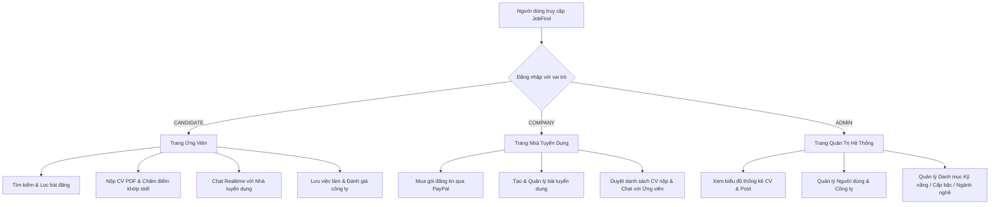

# 💼 JobFind — Hệ Thống Tuyển Dụng & Tìm Việc Làm Real-Time


> **JobFind** là nền tảng kết nối tuyển dụng hiện đại giữa **Ứng viên**, **Nhà tuyển dụng** và **Quản trị viên**. Hệ thống được trang bị giao diện UI/UX tối ưu, tương tác nhắn tin Real-time, phân tích độ khớp kỹ năng từ CV PDF và hệ thống quản trị thống kê trực quan.

---

## ✨ Điểm Nổi Bật & Trải Nghiệm UI/UX

### 🎨 1. Thiết Kế Giao Diện UI/UX Hiện Đại
- **Giao diện Responsive**: Tương thích hoàn hảo trên các thiết bị Desktop, Tablet và Mobile.
- **Tối ưu Trải nghiệm Người dùng (UX)**:
  - Bộ lọc công việc đa tiêu chí (Ngành nghề, Cấp bậc, Mức lương, Hình thức làm việc, Địa điểm).
  - Thanh tìm kiếm thông minh với gợi ý từ khóa tức thì (Typeahead).
  - Hiệu ứng cuộn tùy chỉnh (Custom Scrollbars), Modal tương tác mượt mà không load lại trang.
- **Thẻ việc làm & Công ty nổi bật**: Trình bày thông tin trực quan với logo, mức lương minh bạch, địa điểm và kỹ năng yêu cầu.

### 💬 2. Trò Chuyện Real-time Tức Thì (Socket.IO)
- **Nhắn tin trực tiếp 1-1**: Giữa Ứng viên và đúng Nhà tuyển dụng đang đăng bài.
- **Tương tác Real-time sinh động**:
  - Chấm xanh báo trạng thái **Online / Offline**.
  - Hiệu ứng hiển thị **"Đang soạn tin nhắn..." (Typing indicator)**.
  - Badge đếm số tin nhắn chưa đọc cập nhật ngay lập tức trên thanh Header & Menu điều hướng.
- **Cơ chế Dự phòng (Fallback)**: Tự động chuyển về giao diện REST API nếu kết nối socket gián đoạn.

### 🧠 3. Chấm Điểm Độ Khớp Kỹ Năng CV (Smart CV Matching)
- **Trích xuất dữ liệu từ PDF**: Tự động đọc và phân tích nội dung file CV dạng PDF thật do ứng viên tải lên.
- **Chấm điểm phần trăm (%) tương thích**: So sánh danh sách kỹ năng trong CV với yêu cầu kỹ năng của bài đăng tuyển dụng, giúp nhà tuyển dụng duyệt ứng viên nhanh chóng.

### 📊 4. Dashboard Quản Trị Hệ Thống (Admin & Employer Portal)
- **Biểu đồ thống kê trực quan**: Chart.js hiển thị xu hướng nộp CV, số lượng tin tuyển dụng theo thời gian.
- **Quản lý gói bài đăng & gói xem CV**: Tích hợp thanh toán trực tuyến qua **PayPal Sandbox**.

---

## 🛠️ Công Nghệ Sử Dụng (Tech Stack)

### **Frontend**
- **Core**: React.js (Hooks, Context API, Redux)
- **Styling**: SCSS, Vanilla CSS, Bootstrap 4/5, FontAwesome Icons
- **Real-time**: `socket.io-client`
- **Charts & Editor**: Chart.js, TinyMCE Rich Text Editor
- **HTTP Client**: Axios

### **Backend**
- **Core**: Node.js, Express.js
- **Database ORM**: Sequelize ORM (MySQL / MariaDB)
- **Real-time Server**: Socket.IO
- **Bảo mật & Xác thực**: JWT (JSON Web Token), bcryptjs
- **File Parser & Email**: PDF-Parse, Nodemailer (gửi email gợi ý việc làm)

---

## 📱 Phân Hệ Chức Năng & Luồng Người Dùng (User Flows)



---

## ⚡ Hướng Dẫn Cài Đặt & Chạy Dự Án

### Yêu Cầu Hệ Thống
- **Node.js**: Bản LTS (v16 trở lên)
- **Database**: MySQL hoặc MariaDB (XAMPP / WampServer)

---

### Bước 1: Cấu hình môi trường

Mở file `backend/.env` và kiểm tra thông số kết nối MySQL (Cấu hình mặc định cho XAMPP):

```env
DB_HOST=127.0.0.1
DB_PORT=3333        # Mặc định XAMPP trên máy; nếu dùng MySQL chuẩn hãy đổi thành 3306
DB_NAME=jobfindtest
DB_USER=root
DB_PASSWORD=
PORT=5000
```

---

### Bước 2: Nạp dữ liệu mẫu tự động

Mở Terminal và chạy lệnh sau để tự động tạo database `jobfindtest` cùng dữ liệu demo đầy đủ:

```powershell
cd backend
npm install
$env:CONFIRM_RESTORE_SAMPLE_DATA='true'
npm run restore:sample-data
```

> [!TIP]
> Lệnh trên sẽ khởi tạo **38 tài khoản người dùng**, **41 bài đăng tuyển dụng**, **17 công ty**, dữ liệu chat mẫu, đánh giá công ty và các file PDF CV thật.

---

### Bước 3: Khởi chạy Backend (Port 5000)

```powershell
cd backend
npm start
```
*Server API và Socket.IO sẽ cùng lắng nghe tại port `5000`.*

---

### Bước 4: Khởi chạy Frontend (Port 3000)

Mở một Terminal mới:

```powershell
cd frontend
npm install
npm start
```

TRUY CẬP TRỰC TIẾP: **`http://localhost:3000`**

---

## 🔑 Tài Khoản Đăng Nhập Mẫu (Test Credentials)

> [!IMPORTANT]
> Tất cả các tài khoản trong hệ thống đều dùng chung mật khẩu mặc định là: **`123456`**

### 🏢 1. Nhà Tuyển Dụng (Đăng nhập -> Vào quản trị `/admin`)

| Số Điện Thoại | Họ Và Tên | Tên Công Ty | Số Tin Tuyển Dụng |
| :--- | :--- | :--- | :---: |
| `0764188023` | Nguyễn Văn A | Công ty TNHH CMC GLOBAL | 10 |
| `0785095048` | Nguyễn Lê Tấn | Công ty CP Tập đoàn Hoa Sen | 5 |
| `0795095042` | Nguyễn Văn Tài | Babilala | 2 |
| `0795095038` | Nguyễn Lê Tấn Tài | Đất Xanh Miền Trung | 2 |

### 👨‍💻 2. Ứng Viên (Đăng nhập giao diện chính)

| Số Điện Thoại | Họ Và Tên | Số Kỹ Năng | CV Đã Nộp |
| :--- | :--- | :---: | :---: |
| `0764188123` | Trần Thị My | 8 | 1 |
| `0795095768` | Nguyễn Lê Tấn Tài | 6 | 1 |
| `0764088023` | Lê Thị Kim Ảnh | 5 | 1 |

### 🛡️ 3. Quản Trị Viên (Admin Hệ Thống)

| Số Điện Thoại | Họ Và Tên | Quyền Hạn |
| :--- | :--- | :--- |
| `0795095049` | Nguyễn Lê Tấn Tài | Full System Admin |
| `0795095000` | Nguyễn Văn ADMIN | System Moderator |

---

## 💬 Kịch Bản Test Tính Năng Chat Real-Time

Để kiểm tra trải nghiệm chat real-time tốt nhất:

1. **Trình duyệt 1 (Chế độ thường)**: 
   - Đăng nhập tài khoản **Ứng viên**: `0795095768` (Pass: `123456`).
   - Vào mục **Việc làm** -> Chọn bài viết *"Lập trình viên Reactjs"* của công ty **Babilala**.
   - Bấm nút **"Nhắn tin cho nhà tuyển dụng"**.
2. **Trình duyệt 2 (Chế độ Ẩn danh - Incognito)**:
   - Đăng nhập tài khoản **Nhà tuyển dụng**: `0795095042` (Pass: `123456`).
   - Vào mục **Tin nhắn** ở góc trái menu quản trị.
3. **Thực nghiệm**:
   - Thử gõ tin nhắn ở một bên -> Bên còn lại sẽ nhận ngay lập tức kèm trạng thái **Typing...** và số tin nhắn chưa đọc được cập nhật real-time!

### 🔍 Đang chat với công ty nào thì đăng nhập bằng tài khoản nào?

Khung chat hiển thị **tên công ty**, nhưng đăng nhập lại bằng **số điện thoại của
người phụ trách**. Có 2 cách tra:

**Cách 1 — đọc trên thanh địa chỉ.** Số cuối URL chính là `userId` của nhà tuyển
dụng: `localhost:3000/chat/35` → nhà tuyển dụng có `userId = 35`.

**Cách 2 — tra bảng dưới đây.**

| Công Ty | userId | SĐT Đăng Nhập | Người Phụ Trách |
| :--- | :---: | :--- | :--- |
| Công ty TNHH CMC GLOBAL | 2 | `0764188023` | Nguyễn Văn A |
| Công ty CP Tập đoàn Hoa Sen | 3 | `0785095048` | Nguyễn Lê Tấn |
| FPT Software | 6 | `0764088022` | Lê Thị Kim Ảnh |
| Unilever | 7 | `0764088020` | Lê Thị Kim Ảnh |
| Ninja Van 2 | 10 | `0944043559` | Nguyễn Lê Tấn Tài |
| CÔNG TY CP TẬP ĐOÀN ITP | 16 | `0795095040` | Nguyễn Lê Tấn Tài2 |
| Babilala | 18 | `0795095042` | Nguyễn Văn Tài |
| Đất Xanh Miền Trung | 19 | `0795095038` | Nguyễn Lê Tấn Tài |
| Tập đoàn ABC | 20 | `0795095028` | Nguyễn Lê Tấn D |
| Công ty ABC | 23 | `0795095148` | Nguyễn Văn Tài |
| Công ty TNHH XYZ | 25 | `0795095248` | Nguyễn Lê Tấn Tài |
| Công ty TNHH Thành Công | 27 | `0795095098` | Nguyễn Thị A |
| Công ty TNHH Thế Giới | 29 | `0795095125` | Nguyễn Văn Lộc |
| Công ty phần mềm Tấn Tài | 32 | `0795095111` | Trần Văn Chiến |
| Công ty CP Tấn Tài | 34 | `0795095222` | Trần Văn Nghĩa |
| Công ty TNHH Văn Minh | 35 | `0795095333` | Nguyễn Văn Nhật |
| Cong ty TNHH tieu ban 3 | 37 | `0764188024` | Trần Minh Tiến |

> [!WARNING]
> Hội thoại gắn với **từng người dùng**, không phải với công ty. Một công ty có
> thể có nhiều tài khoản (ví dụ CMC GLOBAL có `userId` 2, 8 và 9002) — chỉ đúng
> tài khoản có `userId` khớp với URL mới nhìn thấy cuộc trò chuyện đó. Đăng nhập
> bằng tài khoản khác cùng công ty sẽ không thấy gì.

---

## 📊 Thống Kê Dữ Liệu Có Sẵn (Demo Database)

| Thành Phần Dữ Liệu | Số Lượng Bản Ghi | Mô Tả |
| :--- | :---: | :--- |
| **Tài khoản người dùng** | `38` | Bao gồm 3 vai trò (Admin, Company, Candidate) |
| **Công ty** | `17` | Có đầy đủ logo, địa chỉ, mô tả |
| **Bài đăng tuyển dụng** | `41` | Tin tuyển dụng chi tiết các ngành IT, Kinh tế... |
| **Hồ sơ CV ứng tuyển** | `6` | Kèm file PDF thật, tự động chấm điểm % khớp skill |
| **Tin nhắn Chat** | `22` | Hội thoại thực giữa ứng viên & nhà tuyển dụng |
| **Đánh giá công ty** | `10` | Đánh giá số sao và nhận xét chi tiết |

---

## 📝 Ghi Chú Phát Triển

- **Cấu hình API**: Frontend kết nối với Backend thông qua file `frontend/.env` (`REACT_APP_BACKEND_URL=http://localhost:5000`).
- **Gửi Email tự động**: Nếu muốn bật tính năng gửi mail gợi ý việc làm, điền cấu hình `EMAIL_APP` và `EMAIL_APP_PASSWORD` trong file `backend/.env`.
- **Thanh toán PayPal**: Đã tích hợp sẵn Client ID PayPal Sandbox trong file môi trường.

---
*Chúc bạn có trải nghiệm tuyệt vời với **JobFind**!* 🚀
