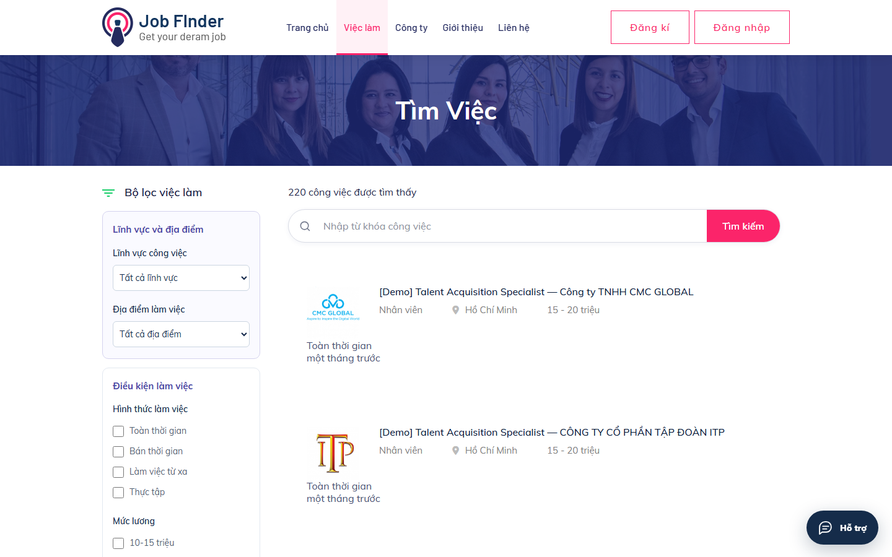
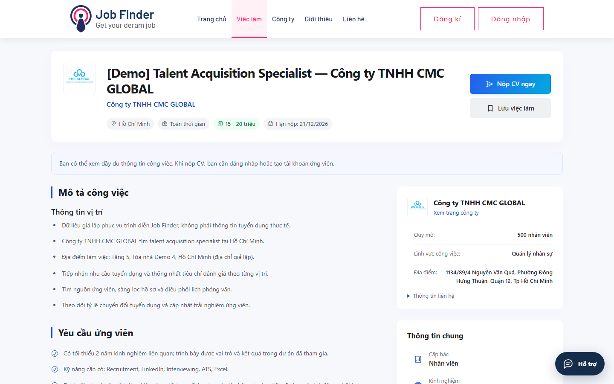
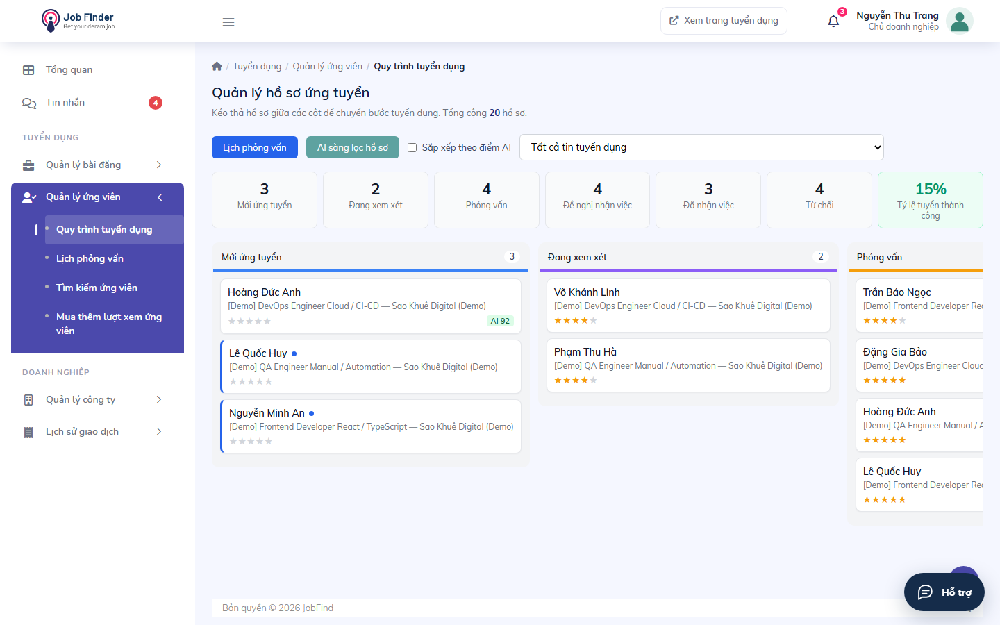
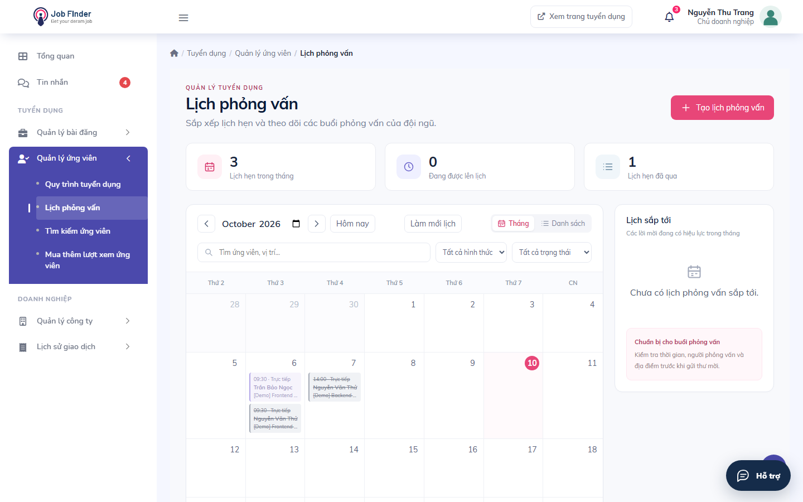
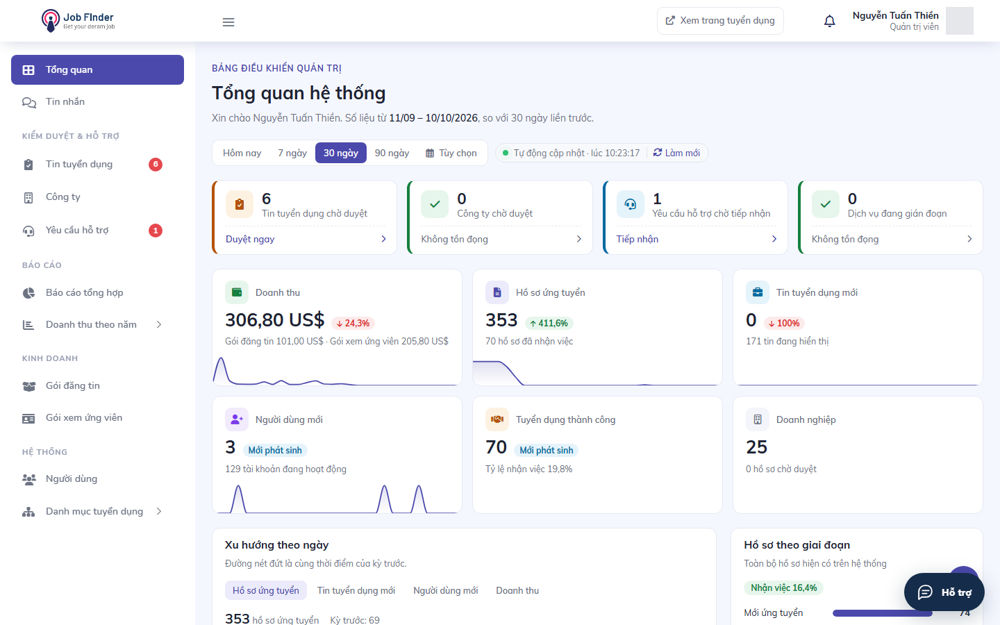
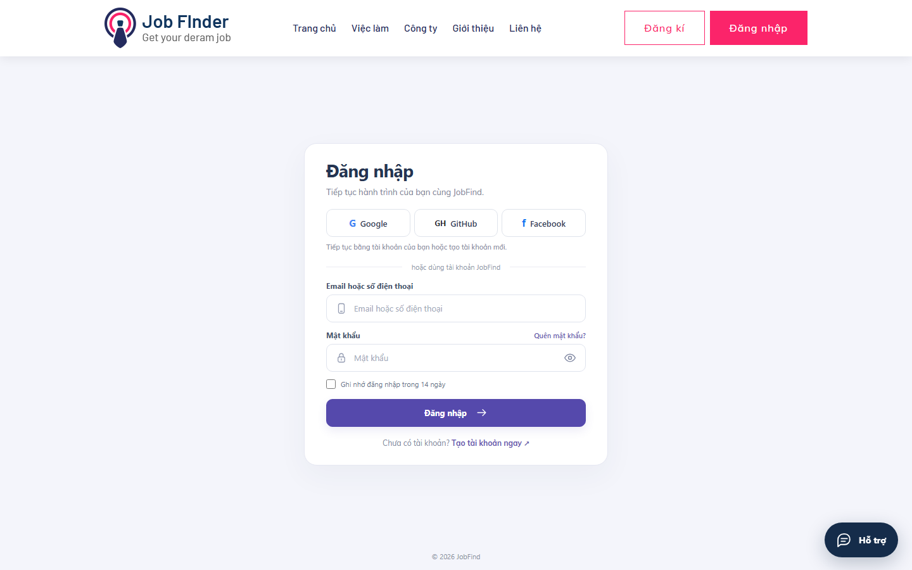
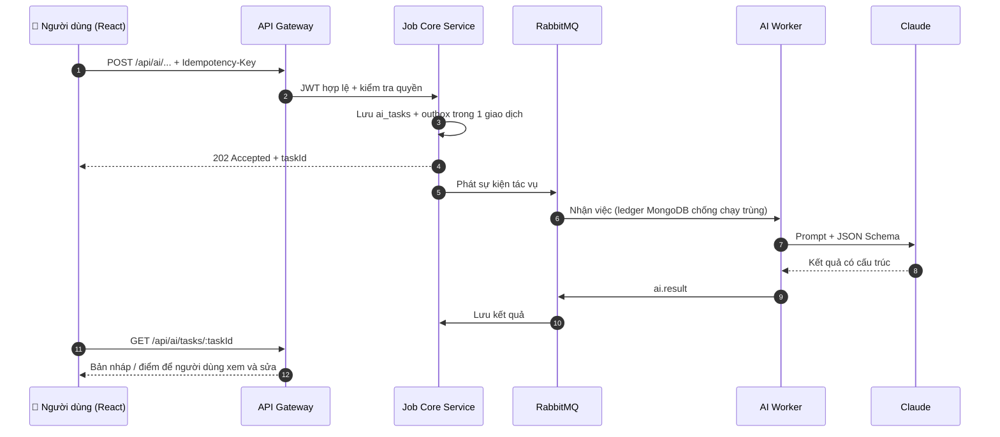
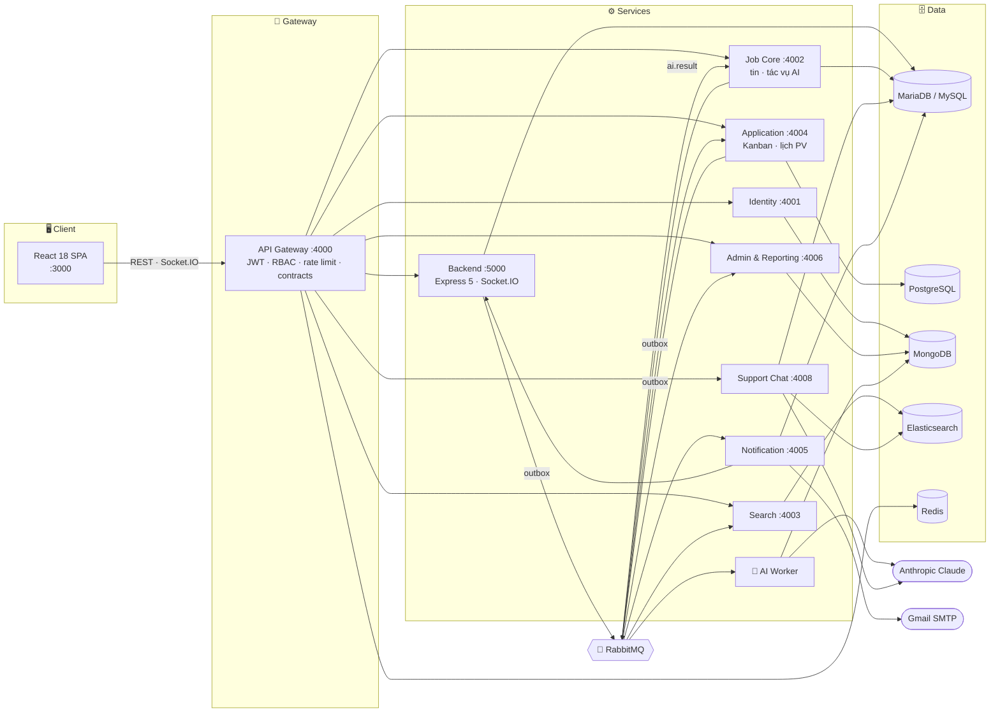
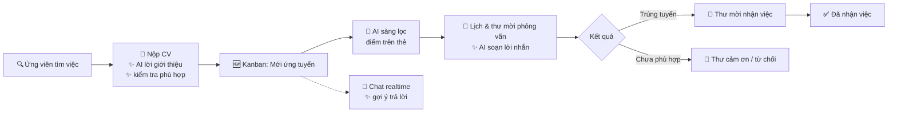

<div align="center">

# 🚀 JobFind

### Nền tảng tuyển dụng thông minh tích hợp AI
**Ứng viên · Nhà tuyển dụng · Quản trị viên** — tìm việc, nộp CV, sàng lọc hồ sơ, lên lịch phỏng vấn, gửi kết quả và trò chuyện trên cùng một hệ thống.

[](https://react.dev)
[](https://nodejs.org)
[](https://www.anthropic.com)
[](https://docs.docker.com/compose/)

[](https://mariadb.org)
[](https://postgresql.org)
[](https://mongodb.com)
[](https://elastic.co)
[](https://rabbitmq.com)
[](https://redis.io)
[](https://socket.io)

[](#-chất-lượng-và-kiểm-thử)
[](#-chất-lượng-và-kiểm-thử)
[](.github/workflows)

[**⚡ Bắt đầu nhanh**](#-bắt-đầu-nhanh) · [**🖼 Giao diện**](#-giao-diện) · [**🎨 UI/UX**](#-uiux) · [**🤖 AI**](#-ai-trong-jobfind) · [**🧱 Kiến trúc**](#-kiến-trúc-hệ-thống) · [**🛠 Tech Stack**](#-tech-stack) · [**👥 Demo**](#-tài-khoản-demo)

</div>

---

## 🌟 Tổng quan

JobFind gồm website **React**, backend **Node.js/Express** và **API Gateway cùng 8 microservice** giao tiếp qua **RabbitMQ**. AI (Anthropic Claude) hỗ trợ ở từng bước — viết CV, chấm độ phù hợp, sàng lọc hồ sơ, soạn thư — nhưng **con người luôn là người quyết định**.

| 🧩 Dịch vụ | 🤖 AI | 🧪 Kiểm thử tự động | 🔁 CI |
| :---: | :---: | :---: | :---: |
| Gateway + 8 microservice + backend | 6 tác vụ AI + chatbot hỗ trợ | 6.545 test · mutation 93% / 91% | 4 workflow GitHub Actions |

<table>
<tr>
<td width="33%" valign="top">

### 👤 Ứng viên
Tìm việc theo nhiều bộ lọc, tạo và đọc CV bằng AI, kiểm tra độ phù hợp trước khi nộp, theo dõi tiến trình, xem lịch phỏng vấn, nhận email kết quả và nhắn tin với nhà tuyển dụng.

</td>
<td width="33%" valign="top">

### 🏢 Nhà tuyển dụng
Đăng tin (AI kiểm duyệt), tìm ứng viên, quản lý hồ sơ trên Kanban 6 bước, AI sàng lọc CV, lên lịch phỏng vấn, gửi thư mời nhận việc và quản lý nhân sự tuyển dụng của công ty.

</td>
<td width="33%" valign="top">

### 🛡 Quản trị viên
Dashboard "Cần xử lý", duyệt tin và công ty, quản lý người dùng, danh mục, gói dịch vụ, báo cáo doanh thu/tuyển dụng và tiếp nhận yêu cầu hỗ trợ từ chatbot.

</td>
</tr>
</table>

### 🆕 Cập nhật gần đây (10/2026)

- 🔐 **Đăng nhập mạng xã hội** Google, GitHub, Facebook qua Auth0; đăng ký nhanh bằng tài khoản mạng xã hội; liên kết tài khoản và quản lý phiên đăng nhập trong **Bảo mật và đăng nhập**.
- 📅 **Lịch phỏng vấn** cho nhà tuyển dụng và ứng viên: xem theo tháng hoặc danh sách, lọc theo hình thức/trạng thái, tải tệp `.ics`.
- 🆘 **Hộp thư hỗ trợ**: chatbot chuyển yêu cầu cho nhân viên; quản trị viên tiếp nhận, trả lời và đánh dấu hoàn tất.
- 📊 **Dashboard quản trị mới**: thẻ "Cần xử lý" (tin/công ty chờ duyệt, yêu cầu hỗ trợ), số liệu so với kỳ trước, biểu đồ xu hướng và phễu tuyển dụng.
- 🔍 **Tìm việc chính xác hơn**: chỉ hiện tin còn hạn; tin đăng trên JobFind đứng trước tin tổng hợp từ nguồn tuyển dụng chính thức.
- 🚢 **Triển khai VPS** bằng Docker Compose, HTTPS tự động (Caddy), chuyển dữ liệu từ máy dev và sao lưu định kỳ.
- ✅ **Chất lượng**: 6.545 test tự động, mutation testing cho mã bảo mật/thanh toán, `npm audit` không còn cảnh báo high/critical.

---

## 🖼 Giao diện

<table>
<tr>
<td width="50%"><br><sub><b>Tìm việc</b> — bộ lọc nhiều lựa chọn, tin JobFind đứng đầu</sub></td>
<td width="50%"><br><sub><b>Chi tiết việc làm</b> — hạn nộp, mức lương, nút Nộp CV ngay</sub></td>
</tr>
<tr>
<td width="50%"><br><sub><b>Kanban tuyển dụng</b> — kéo thả 6 bước, điểm AI trên thẻ</sub></td>
<td width="50%"><br><sub><b>Lịch phỏng vấn</b> — xem theo tháng/danh sách, lọc và tìm kiếm</sub></td>
</tr>
<tr>
<td width="50%"><br><sub><b>Dashboard quản trị</b> — việc cần xử lý, KPI và xu hướng</sub></td>
<td width="50%"><br><sub><b>Đăng nhập</b> — số điện thoại/email hoặc Google, GitHub, Facebook</sub></td>
</tr>
</table>

---

## 🎨 UI/UX

Giao diện ưu tiên **thao tác nhanh**, **trạng thái rõ ràng**, **không mất ngữ cảnh** và **AI luôn ở vai trò trợ lý**.

### 🧭 Nguyên tắc thiết kế

| Nguyên tắc | Cách áp dụng |
| --- | --- |
| 👀 **Người dùng luôn kiểm soát** | Kết quả AI hiện trong khung gợi ý riêng với **Dùng nội dung này** / **Bỏ qua**; không tự điền đè, không tự gửi |
| 🏷 **AI dễ nhận biết** | Nhãn **AI** màu xanh ngọc, nút và khung gợi ý cùng tông; ghi rõ dữ liệu nào được gửi tới dịch vụ AI |
| ⏳ **Trạng thái rõ ràng** | "AI đang viết…", "AI đang chấm…", nút **Dừng chờ**; điểm trên Kanban tự cập nhật khi có kết quả |
| 💸 **Xác nhận thao tác quan trọng** | Hộp xác nhận số hồ sơ trước khi sàng lọc hàng loạt, xác nhận người nhận trước khi gửi thư kết quả |
| 🔁 **Bền vững khi mạng chập chờn** | Gửi lại dùng cùng mã yêu cầu; tin nhắn chưa xác nhận giữ nội dung kèm nút gửi lại; tự thử lại khi xác minh phiên gặp lỗi tạm thời |
| ♿ **Truy cập được** | `aria-label`, `role="status"`/`role="alert"`, thao tác bàn phím trên Kanban, menu và lịch |

### 🖼 Theo từng khu vực

| Khu vực | Trải nghiệm |
| --- | --- |
| 🏠 **Trang chủ** | Banner gọn, danh mục ngành nghề, việc làm mới và việc làm nổi bật (chỉ tin còn hạn) |
| 🔍 **Tìm việc** | Bộ lọc bên trái, thẻ việc bên phải, gợi ý khi gõ; giữ bộ lọc, trang và vị trí cuộn khi quay lại |
| 📄 **Chi tiết việc làm** | Bố cục 2 cột: nội dung tin bên trái; thẻ công ty, **Nộp CV ngay**, lưu việc, chuẩn bị CV với AI bên phải |
| 📨 **Nộp CV** | Chọn nguồn CV, xem trước PDF, **Trợ lý AI ứng tuyển** với 2 phương án lời giới thiệu và thẻ điểm phù hợp |
| 🔐 **Đăng nhập / Đăng ký** | Thẻ trung tâm, nút Google · GitHub · Facebook, ghi nhớ 14 ngày, hiện/ẩn mật khẩu, kiểm tra từng trường bằng tiếng Việt |
| 🛡 **Bảo mật tài khoản** | Liên kết tài khoản mạng xã hội, danh sách phiên đăng nhập, đăng xuất từng thiết bị hoặc tất cả |
| 🔧 **Khu quản trị** | Sidebar theo vai trò, badge "cần xử lý", breadcrumb, chỉ mở một nhóm menu, header có chuông thông báo realtime |
| 📋 **Kanban** | Mã màu từng bước, kéo thả phản hồi ngay, modal chi tiết giữ ngữ cảnh; **AI sàng lọc hồ sơ**, **Sắp xếp theo điểm AI**, huy hiệu điểm 4 mức màu |
| 📅 **Lịch phỏng vấn** | Thẻ thống kê, lịch tháng với sự kiện theo màu trạng thái, cột "Lịch sắp tới", tạo lịch và xem trước thư mời |
| ✉️ **Gửi kết quả & email** | Ba nút mời phỏng vấn / trúng tuyển / không trúng tuyển, **AI soạn lời nhắn**; email dạng thẻ, CSS inline tương thích Gmail/Outlook/mobile |
| 💬 **Chat** | 2 panel kiểu Messenger, đang gõ, đã đọc, đính kèm PDF, thẻ tin tuyển dụng, gợi ý trả lời và viết lại bằng AI |
| 🤖 **Chatbot hỗ trợ** | Widget nổi góc phải, Markdown, gợi ý câu hỏi nhanh, lịch sử theo tài khoản, chuyển nhân viên hỗ trợ |
| 📊 **Dashboard** | Chọn khoảng thời gian, so sánh kỳ trước, biểu đồ xu hướng/phân bố/phễu (Chart.js, Recharts), tự làm mới |
| 📱 **Responsive** | Desktop/tablet/mobile, menu hamburger, bảng và lịch co theo màn hình |

---

## ✨ Tính năng theo vai trò

<details open>
<summary><b>👤 Ứng viên</b></summary>

- **Tìm việc** (`/job`): từ khóa có gợi ý, lọc ngành nghề, 34 tỉnh/thành (đơn vị hành chính từ 01/07/2025), mức lương, cấp bậc, hình thức, kinh nghiệm.
- **Tin có nguồn đối chiếu** (`/external-job/:id`): tin từ cổng tuyển dụng chính thức, kèm liên kết bài gốc và ngày kiểm tra.
- **Nộp CV**: tệp PDF, CV online hoặc CV đã chuẩn bị; AI viết lời giới thiệu ≤ 255 ký tự và chấm độ phù hợp 0–100.
- **Không gian AI** (`/candidate/ai-cv`): tạo CV, đọc CV PDF thành dữ liệu có cấu trúc, đánh giá độ phù hợp, viết thư ứng tuyển, xuất PDF.
- **Theo dõi ứng tuyển** (`/candidate/cv-post`) và **lịch phỏng vấn** (`/candidate/interviews`).
- **Thông báo**, việc làm từ công ty đang theo dõi, việc làm gợi ý, việc đã lưu.
- **Tin nhắn** realtime với nhà tuyển dụng, gửi CV/PDF, chia sẻ tin; **email** mời phỏng vấn (thêm vào Google Calendar), mời nhận việc, cảm ơn sau phỏng vấn.

</details>

<details open>
<summary><b>🏢 Nhà tuyển dụng</b></summary>

- **Công ty**: thông tin, logo, giấy tờ PDF; chủ công ty quản lý nhân viên tuyển dụng.
- **Tin tuyển dụng**: đăng mới, sửa (chống ghi đè), đăng lại; tin mới được **AI kiểm duyệt**; mua gói đăng tin/gói xem CV qua PayPal.
- **Tìm ứng viên phù hợp**: lọc theo kỹ năng/ngành/địa điểm, điểm có giải thích, đối chiếu CV bằng AI.
- **Kanban** (`/admin/pipeline`): Mới ứng tuyển → Đang xem xét → Phỏng vấn → Đề nghị nhận việc → Đã nhận việc / Từ chối; chấm sao, ghi chú nội bộ, lịch sử, phễu tuyển dụng.
- **AI sàng lọc hồ sơ**: chấm tối đa 50 hồ sơ/lần, xếp theo điểm, xem kỹ năng khớp/thiếu và nội dung cần trao đổi.
- **Lịch phỏng vấn** (`/admin/interviews`), **thư mời phỏng vấn**, **thư mời nhận việc**, **AI soạn lời nhắn**; nhà tuyển dụng luôn xem trước rồi mới gửi.

</details>

<details open>
<summary><b>🛡 Quản trị viên</b></summary>

- **Dashboard** (`/admin/`): việc cần xử lý, doanh thu, hồ sơ, người dùng, tỷ lệ nhận việc, so sánh với kỳ trước.
- Duyệt/từ chối/chặn tin và công ty; quản lý người dùng, danh mục, gói dịch vụ, lịch sử giao dịch.
- **Báo cáo** (`/admin/reports`): chuỗi thời gian, phân bố, phễu, nhật ký hoạt động; doanh thu theo năm.
- **Hỗ trợ** (`/admin/support`): tiếp nhận yêu cầu từ chatbot, xem hội thoại, trả lời và hoàn tất.

</details>

---

## 🤖 AI trong JobFind

AI chạy trong **AI Worker** (không mở cổng HTTP) và nhận việc qua RabbitMQ, nên một đợt yêu cầu lớn chỉ làm hàng đợi dài ra chứ không làm nghẽn API. Khóa API chỉ nằm ở máy chủ, không bao giờ ở frontend.

| Bước | Ứng viên | Nhà tuyển dụng |
| --- | --- | --- |
| 📝 **Chuẩn bị** | Tạo CV, đọc CV PDF, viết thư ứng tuyển | Tin đăng mới được AI kiểm duyệt trước khi hiển thị |
| 📨 **Nộp hồ sơ** | Lời giới thiệu ≤ 255 ký tự, kiểm tra độ phù hợp | — |
| 🔎 **Sàng lọc** | — | Đối chiếu CV khi tìm ứng viên; **AI sàng lọc hồ sơ** trên Kanban |
| ✉️ **Thông báo kết quả** | Nhận email có lời nhắn cá nhân | **AI soạn lời nhắn** cho thư mời / trúng tuyển / từ chối |
| 💬 **Trao đổi & hỗ trợ** | Gợi ý trả lời, viết lại tin nhắn; chatbot tìm việc, tra cứu hồ sơ | Gợi ý trả lời, viết lại tin nhắn; chatbot hỏi đáp |

| Tác vụ AI Worker | Sự kiện | Kết quả |
| --- | --- | --- |
| Resume Parser | `ai.parse_resume` | CV PDF → JSON có cấu trúc |
| CV Generator | `ai.generate_cv` | Bản nháp CV từ thông tin ứng viên |
| Smart Matching | `ai.match_cv` | Điểm 0–100, kỹ năng khớp/thiếu, điểm mạnh, nội dung cần trao đổi |
| Content Moderation | `ai.moderate_job` | Duyệt/chặn tin, mức rủi ro, loại vi phạm (lừa đảo, thu phí, phân biệt đối xử…) |
| Cover Letter | `ai.cover_letter` | Thư ứng tuyển tiếng Việt hoặc tiếng Anh |
| Writing Assistant | `ai.write_assist` | Lời giới thiệu, lời nhắn email, gợi ý/viết lại tin nhắn chat |


```mermaid
sequenceDiagram
    autonumber
    participant U as 🧑 Người dùng (React)
    participant G as API Gateway
    participant J as Job Core Service
    participant Q as RabbitMQ
    participant W as AI Worker
    participant C as Claude
    U->>G: POST /api/ai/... + Idempotency-Key
    G->>J: JWT hợp lệ + kiểm tra quyền
    J->>J: Lưu ai_tasks + outbox trong 1 giao dịch
    J-->>U: 202 Accepted + taskId
    J->>Q: Phát sự kiện tác vụ
    Q->>W: Nhận việc (ledger MongoDB chống chạy trùng)
    W->>C: Prompt + JSON Schema
    C-->>W: Kết quả có cấu trúc
    W->>Q: ai.result
    Q->>J: Lưu kết quả
    U->>G: GET /api/ai/tasks/:taskId
    G-->>U: Bản nháp / điểm để người dùng xem và sửa
```

> [!IMPORTANT]
> **Nguyên tắc an toàn của AI**
> - AI **không tự gửi** email/tin nhắn, **không tự chuyển bước** hay loại ứng viên.
> - Chỉ dùng sự thật có trong CV/hội thoại; không bịa kinh nghiệm, lương, ngày giờ hay cam kết.
> - Khi chấm CV, AI **bỏ qua tuổi, giới tính, vùng miền, tôn giáo, tình trạng hôn nhân, sức khỏe**.
> - Nội dung người dùng là dữ liệu, không phải chỉ dẫn (chống prompt injection); gửi lại dùng **cùng Idempotency-Key** nên không tính hai lần.

Đặc tả API: [`gateway.openapi.json`](microservices/contracts/http/gateway.openapi.json) · Hướng dẫn: [AI tuyển dụng](docs/ai-recruitment.md) · [AI cho CV](docs/ai-cv.md)

---

## 🧱 Kiến trúc hệ thống


```mermaid
flowchart LR
    subgraph Client["🖥 Client"]
        UI["React 18 SPA<br/>:3000"]
    end

    subgraph Edge["🚪 Gateway"]
        GW["API Gateway :4000<br/>JWT · RBAC · rate limit · contracts"]
    end

    subgraph Services["⚙ Services"]
        Legacy["Backend :5000<br/>Express 5 · Socket.IO"]
        Identity["Identity :4001"]
        Job["Job Core :4002<br/>tin · tác vụ AI"]
        Search["Search :4003"]
        Apps["Application :4004<br/>Kanban · lịch PV"]
        Notify["Notification :4005"]
        Admin["Admin & Reporting :4006"]
        Support["Support Chat :4008"]
        AI["🤖 AI Worker"]
    end

    subgraph Data["🗄 Data"]
        MySQL[("MariaDB / MySQL")]
        Postgres[("PostgreSQL")]
        Mongo[("MongoDB")]
        ES[("Elasticsearch")]
        Redis[("Redis")]
    end

    MQ{{"🐇 RabbitMQ"}}
    Claude(["Anthropic Claude"])
    Mail(["Gmail SMTP"])

    UI -->|"REST · Socket.IO"| GW
    GW --> Legacy & Identity & Job & Search & Apps & Admin & Support
    Legacy --> MySQL
    Job --> MySQL
    Apps --> Postgres
    Identity --> Mongo
    Admin --> Mongo
    Search --> ES
    Support --> MySQL & ES
    Notify --> MySQL
    GW --> Redis
    Legacy & Job & Apps -->|outbox| MQ
    MQ --> Search & AI & Notify & Admin & Apps
    MQ -->|ai.result| Job
    AI --> Mongo
    AI --> Claude
    Support --> Claude
    Notify --> Mail
    Notify --> Legacy
```

| Service | Cổng | Kho dữ liệu | Trách nhiệm |
| --- | ---: | --- | --- |
| `api-gateway` | 4000 | Redis | Cổng API duy nhất: JWT, RBAC, xóa header định danh giả, rate limit, circuit breaker, proxy Socket.IO |
| `identity-service` | 4001 | MongoDB | Hồ sơ cá nhân, CV Builder |
| `job-core-service` | 4002 | MySQL | Ghi tin, quota gói tin, kiểm duyệt, tạo tác vụ AI và lưu kết quả |
| `search-service` | 4003 | Elasticsearch | Chỉ mục, tìm kiếm full-text, gợi ý, facet, đồng bộ CQRS |
| `application-service` | 4004 | PostgreSQL | Kanban, ghi chú, chấm sao, phễu, lịch phỏng vấn, thư mời/kết quả |
| `notification-service` | 4005 | MySQL | Thông báo, email (Nodemailer/Gmail), đẩy realtime |
| `admin-service` | 4006 | MongoDB (đọc PostgreSQL, MySQL) | Báo cáo, master data, audit log |
| `support-chat-service` | 4008 | MySQL, Elasticsearch | Chatbot đa nhà cung cấp, kho kiến thức, chuyển nhân viên hỗ trợ |
| `ai-worker` | — | MongoDB (ledger) | 6 loại tác vụ AI qua RabbitMQ |
| `backend` | 5000 | MySQL | API gốc, đăng nhập/SSO, Socket.IO, chat, CV đã nộp, thanh toán, Web Push |

> [!TIP]
> Hợp đồng HTTP (OpenAPI 3.1) và sự kiện (JSON Schema) được **sinh từ một nguồn** trong `microservices/shared/contracts`; CI kiểm tra chúng khớp với mã nguồn. Ghi dữ liệu và phát sự kiện dùng **transactional outbox** nên không mất sự kiện khi một service tạm ngừng.

### 🔄 Luồng tuyển dụng đầu cuối


```mermaid
flowchart LR
    A["🔍 Ứng viên tìm việc"] --> B["📨 Nộp CV<br/>✨ AI lời giới thiệu<br/>✨ kiểm tra phù hợp"]
    B --> C["🆕 Kanban: Mới ứng tuyển"]
    C --> D["🧠 AI sàng lọc<br/>điểm trên thẻ"]
    D --> E["📅 Lịch & thư mời phỏng vấn<br/>✨ AI soạn lời nhắn"]
    E --> F{"Kết quả"}
    F -->|Trúng tuyển| G["📨 Thư mời nhận việc"]
    F -->|Chưa phù hợp| H["💌 Thư cảm ơn / từ chối"]
    G --> I["✅ Đã nhận việc"]
    C -.-> J["💬 Chat realtime<br/>✨ gợi ý trả lời"]
```

Mỗi bước chuyển trạng thái được lưu cùng sự kiện outbox trong một giao dịch; `notification-service` lưu thông báo, đẩy realtime nếu ứng viên đang online và gửi email có `Reply-To` về HR.

<details>
<summary><b>📁 Cấu trúc thư mục</b></summary>

```text
job_find/
├── backend/            # Express 5 + Sequelize: API gốc, đăng nhập/SSO, Socket.IO, chat, thanh toán
├── frontend/           # React 18 SPA (auth, container theo khu vực, components, service)
├── microservices/      # API Gateway + 8 service, shared contracts, docker-compose, ops (Prometheus)
├── deploy/             # Triển khai VPS: docker-compose production, Caddy, script dữ liệu/sao lưu
├── scripts/            # Trình khởi chạy npm start, sao lưu/khôi phục, release, tin có nguồn
├── vendor/             # Bản vá phụ thuộc tại chỗ (braces)
├── docs/               # Hướng dẫn tính năng, kiểm thử, ảnh README
├── database/           # Dump dữ liệu mẫu
└── .github/workflows/  # authentication · microservices · realtime · mutation
```

</details>

---

## 🛠 Tech Stack

### 🖥 Frontend

| Công nghệ | Phiên bản | Vai trò |
| --- | --- | --- |
| React · React DOM | 18.3 | SPA, StrictMode |
| React Router | 7.18 | Định tuyến, bảo vệ route theo vai trò |
| Create React App (react-scripts) | 5.0 | Build, dev server, Jest |
| Ant Design · Reactstrap · Sass | 5.29 · 9.2 · 1.101 | Thành phần giao diện, khu quản trị, SCSS |
| Axios | 1.20 | HTTP client, tự gia hạn phiên và thử lại |
| Socket.IO Client | 4.8 | Chat, thông báo, trạng thái đang gõ |
| Chart.js · Recharts | 4.5 · 2.15 | Dashboard và báo cáo |
| assistant-ui | 0.15 | Giao diện chatbot hỗ trợ |
| React-PDF · pdf-lib | 10.4 · 1.17 | Xem trước và tạo CV PDF |
| markdown-it · react-datepicker | 14.3 · 8 | Hiển thị Markdown, chọn ngày giờ |

### 🧩 Backend

| Công nghệ | Phiên bản | Vai trò |
| --- | --- | --- |
| Node.js | ≥ 22.12 | Runtime cho toàn bộ dịch vụ |
| Express | 5.2 (backend) · 4.22 (microservices) | HTTP API |
| Sequelize · mysql2 | 6.37 · 3.23 | ORM và driver MySQL/MariaDB |
| Socket.IO + Redis Streams adapter | 4.8 · 0.3 | Realtime nhiều tiến trình |
| jsonwebtoken · openid-client | 9 · 6.8 | Access token, refresh cookie HttpOnly, SSO OIDC (Auth0) |
| amqplib | 0.10 | RabbitMQ, transactional outbox |
| Nodemailer · web-push | 10 · 3.6 | Email Gmail, Web Push (VAPID) |
| PayPal REST SDK · Cloudinary | 1.8 · 2.10 | Thanh toán sandbox, lưu ảnh/tài liệu |
| AJV | 8.20 | Kiểm tra hợp đồng HTTP/sự kiện (JSON Schema) |
| http-proxy-middleware · opossum · ioredis | 3.0 · 10 · 5.11 | Gateway: proxy, circuit breaker, rate limit |
| @elastic/elasticsearch · mongoose · pg | 8.19 · 8.24 · 8.22 | Client Elasticsearch, MongoDB, PostgreSQL |
| OpenTelemetry | 1.9 | Truy vết realtime (tùy chọn) |

### 🤖 AI

| Công nghệ | Phiên bản | Vai trò |
| --- | --- | --- |
| Anthropic SDK (`@anthropic-ai/sdk`) | 0.115 | AI Worker: structured output theo JSON Schema |
| Vercel AI SDK (`ai`, `@ai-sdk/*`) · zod | 7.0 · 4 | Chatbot đa nhà cung cấp: Claude, OpenAI, Gemini, Ollama; gọi công cụ tìm việc |
| pdfjs-dist | 5.4 | Trích chữ CV PDF tại máy chủ |

### 🗄 Dữ liệu và hạ tầng

| Công nghệ | Phiên bản | Vai trò |
| --- | --- | --- |
| MariaDB / MySQL | 10.4 (XAMPP) · 10.11 (VPS) · MySQL 8.0 (CI) | Dữ liệu gốc: tài khoản, tin, CV, chat, thanh toán |
| PostgreSQL | 16 | Hồ sơ ứng tuyển, Kanban, lịch phỏng vấn |
| MongoDB | 7 | Hồ sơ cá nhân, CV Builder, ledger AI, audit |
| Elasticsearch | 8.15 | Tìm kiếm việc làm, gợi ý, kho kiến thức chatbot |
| RabbitMQ | 4 | Hàng đợi sự kiện và tác vụ AI |
| Redis | 7 | Rate limit, Socket.IO adapter |
| Docker Compose · `node:22-alpine` | Compose v2 | Môi trường local và production, image multi-stage |
| Caddy | 2 | Reverse proxy, HTTPS tự động trên VPS |
| Prometheus | 3.5 | Metrics và cảnh báo |

### 🧪 Chất lượng và CI

| Công nghệ | Phiên bản | Vai trò |
| --- | --- | --- |
| Jest · React Testing Library · user-event | 30.5 (backend) · 16 · 14 | Unit/component test |
| Vitest + coverage v8 | 4.1 | Test microservices, ngưỡng coverage |
| Playwright | 1.62 / 1.63 | Hành trình trình duyệt thật |
| Stryker Mutator | 9.6 | Mutation testing mã bảo mật, thanh toán, hạn mức |
| ESLint (react-app) · npm audit | — | Lint không cảnh báo, kiểm tra phụ thuộc mức high |
| GitHub Actions | — | 4 workflow: microservices, xác thực, realtime, mutation |

---

## ⚡ Bắt đầu nhanh

| Yêu cầu | Chi tiết |
| --- | --- |
| **Node.js** | 22.12 trở lên |
| **Docker Desktop** | Compose V2, RAM tối thiểu 8 GB |
| **XAMPP (MariaDB/MySQL)** | Database `jobfindtest`, cổng `3333` |
| **Khóa AI** (tùy chọn) | `ANTHROPIC_API_KEY` để bật các chức năng AI |

**1. Cấu hình** — sao chép các file mẫu và điền giá trị:

| File | Từ mẫu | Cần điền |
| --- | --- | --- |
| `backend/.env` | `backend/.env.example` | Kết nối DB, `JWT_SECRET`, `INTERNAL_SECRET` (≥ 32 ký tự, giống microservices) |
| `microservices/.env` | `microservices/.env.example` | Kết nối DB, mật khẩu RabbitMQ/PostgreSQL, cùng secret; tùy chọn khóa AI, Gmail App Password, `LOCAL_EMAIL_DELIVERY` |
| `frontend/.env` | `frontend/.env.example` | `REACT_APP_BACKEND_URL` và các cờ tính năng |

**2. Khởi chạy** — từ thư mục gốc:

```powershell
npm start
```

Mở **http://localhost:3000**. Trình khởi chạy kiểm tra cấu hình, mở Docker Desktop, chờ MySQL, sao lưu dữ liệu vào `.local/backups`, dựng các service từ mã nguồn rồi chạy backend và frontend. AI Worker chỉ bật khi đã có khóa AI.

**3. Dữ liệu demo** (tùy chọn):

```powershell
npm run seed:demo-data      # bổ sung công ty, ứng viên, hồ sơ demo (thêm -- --dry-run để xem trước)
npm run demo:show-jobs      # hiện các tin [Demo] (ẩn lại bằng demo:hide-jobs)
```

| Lệnh | Mô tả |
| --- | --- |
| `npm run dev:status` · `dev:stop` | Trạng thái (kèm kênh email) · dừng ứng dụng, giữ dữ liệu |
| `npm run dev:check` | Đối chiếu dữ liệu API với MySQL thật, không ghi dữ liệu |
| `npm run check` | Lint, test có ngưỡng coverage, build, audit — chạy trước khi push |

> [!TIP]
> Sửa mã microservices thì chạy lại `npm start` để dựng lại image. Xem thêm [Chạy với dữ liệu thật](docs/run-with-real-data.md).

<details>
<summary><b>🔌 Các cổng sử dụng</b></summary>

| Thành phần | Cổng |
| --- | ---: |
| Frontend React | **3000** |
| API Gateway (cổng duy nhất frontend gọi) | **4000** |
| Backend + Socket.IO | 5000 |
| Identity · Job Core · Search · Application | 4001 · 4002 · 4003 · 4004 (nội bộ Docker) |
| Notification · Admin · Support Chat | 4005 · 4006 · 4008 (nội bộ Docker) |
| MariaDB/MySQL (XAMPP) | 3333 |
| PostgreSQL · MongoDB · Elasticsearch · Redis | 5435 · 27019 · 9201 · 6380 |
| RabbitMQ AMQP · Management UI | 5673 · 15673 |
| Prometheus (profile `monitoring`) | 9091 |

</details>

---

## 👥 Tài khoản demo

> [!WARNING]
> Chỉ dùng cho môi trường local/demo. Đổi toàn bộ mật khẩu trước khi đưa lên môi trường thật.

**Bộ dữ liệu demo** (`npm run seed:demo-data`) — mật khẩu **`Demo@123456`**:

| Vai trò | Số điện thoại | Gợi ý |
| --- | --- | --- |
| 🏢 Nhà tuyển dụng (chủ công ty) | `0918800001` → `0918800008` | `0918800001` — Sao Khuê Digital: Kanban đủ 6 bước, lịch phỏng vấn, thử **AI sàng lọc hồ sơ** |
| 👔 Nhân viên tuyển dụng | `0938800001` → `0938800008` | Cùng công ty với chủ tài khoản tương ứng |
| 👤 Ứng viên | `0928800001` → `0928800072` | `0928800001` — Nguyễn Minh An |

**Tài khoản sẵn có** — mật khẩu **`123456`**:

| Vai trò | Số điện thoại |
| --- | --- |
| 🛡 Quản trị viên | `0795095049` |
| 🏢 Nhà tuyển dụng | `0795095042` |
| 👤 Ứng viên | `0764188123` |

Kịch bản trình diễn: [docs/demo-data.md](docs/demo-data.md)

---

## 🧪 Chất lượng và kiểm thử

```powershell
npm run check
```

Lần lượt chạy: lint frontend → test cả ba phần với ngưỡng coverage → test công cụ vận hành → kiểm tra hợp đồng HTTP/sự kiện → build → `npm audit` mức high → kiểm tra bản vá [`vendor/`](vendor/README.md) với advisory upstream. Unit test mock toàn bộ dịch vụ ngoài nên không cần Docker/XAMPP.

**Kết quả gần nhất (10/10/2026): `npm run check` đạt**

| Phần | Test | Coverage (statements) | Mutation |
| --- | --- | :---: | :---: |
| Backend (Jest) | 90 bộ · 2.490 test | 96,8% | 93,25% |
| Frontend (Jest + RTL) | 122 bộ · 2.230 test | 90,7% | — |
| Microservices (Vitest) | 76 tệp · 1.825 test | 95,9% | 91,47% |

Ngoài unit test, dự án có kiểm thử tích hợp trên container dùng một lần (MySQL, PostgreSQL, RabbitMQ, Elasticsearch, Redis), hành trình trình duyệt bằng Playwright qua Compose thật, và kiểm tra với nhà cung cấp thật (Claude, Gmail, PayPal sandbox, Auth0).

| Workflow | Kiểm tra |
| --- | --- |
| 🐳 `microservices.yml` | Unit test + coverage, hợp đồng, audit, build image, hành trình nhà tuyển dụng/ứng viên, hội tụ tìm kiếm, sự kiện trên broker riêng |
| 🔐 `authentication.yml` | Phiên đăng nhập, chữ ký OIDC, hành trình trình duyệt trên MySQL tạm |
| ⚡ `realtime.yml` | Socket.IO, Redis adapter, chat và Web Push có mã hóa |
| 🧬 `mutation.yml` | Stryker cho mã bảo mật/thanh toán/hạn mức; pull request chạy incremental, lịch tuần chạy đầy đủ |

Chi tiết: [Hướng dẫn kiểm thử](docs/testing.md)

---

## 🚢 Triển khai

Toàn bộ hệ thống chạy bằng Docker Compose trên **một VPS Linux**; chỉ Caddy mở cổng 80/443 và tự cấp chứng chỉ HTTPS.

```powershell
npm run vps:env            # tạo deploy/.env (sinh mật khẩu mới)
npm run vps:export-data    # xuất dữ liệu đang dùng để nạp lên VPS
npm run vps:check-sso -- https://ten-mien-cua-ban   # kiểm tra nút Google/GitHub/Facebook
```

- [ ] Thay toàn bộ secret (`JWT_SECRET`, `INTERNAL_SECRET`, mật khẩu DB, khóa AI)
- [ ] Đặt tên miền HTTPS cho `PUBLIC_URL` (bắt buộc với đăng nhập mạng xã hội)
- [ ] Dùng tài khoản email chuyên dụng
- [ ] Bật sao lưu định kỳ và cảnh báo Prometheus

Hướng dẫn đầy đủ: [deploy/README.md](deploy/README.md) · [Bộ phát hành và quay lui](microservices/docs/release-preparation.md)

---

## 🔒 Bảo mật và quyền riêng tư

- 🔐 **Phiên đăng nhập**: access token 15 phút + refresh token trong cookie HttpOnly (14 ngày khi ghi nhớ), xoay vòng mỗi lần gia hạn, thu hồi khi đổi mật khẩu/khóa tài khoản; đăng nhập mạng xã hội qua OIDC (Auth0).
- 🛡 Gateway **xóa header định danh** do client gửi trước khi gắn danh tính đã xác thực; service chỉ nhận request đã ký bằng khóa nội bộ.
- 🏢 Quyền theo vai trò và theo công ty được đọc lại từ CSDL ở mỗi yêu cầu: nhà tuyển dụng chỉ thấy hồ sơ, CV và kết quả AI của công ty mình.
- 🤖 **AI và dữ liệu cá nhân**: chỉ gửi dữ liệu khi người dùng bấm nút AI; trình duyệt không lưu PDF hay kết quả AI; lỗi từ nhà cung cấp AI không lộ ra người dùng.
- ⚡ Rate limit cho đăng nhập, OTP, route ghi và route AI; thanh toán chỉ cộng quyền lợi khi PayPal xác nhận giao dịch.
- 💬 Chatbot không log nội dung tin nhắn; Web Push chỉ báo "Bạn có tin nhắn mới".
- 📦 Phụ thuộc được kiểm tra bằng `npm audit` trong CI; lỗ hổng chưa có bản vá chính thức được vá tại chỗ kèm test ([vendor/README.md](vendor/README.md)).
- 🔑 Không commit `.env`, App Password Gmail, JWT secret hay khóa AI.

---

## 📚 Tài liệu

| 🤖 AI | 📋 Tuyển dụng | 🧱 Kiến trúc & Vận hành |
| --- | --- | --- |
| [AI trong tuyển dụng](docs/ai-recruitment.md) | [Thư mời phỏng vấn](docs/recruitment-interview-email.md) | [Kiến trúc microservices](microservices/README.md) |
| [AI cho CV](docs/ai-cv.md) | [Thư mời nhận việc](docs/recruitment-offer-email.md) | [Phân quyền](docs/AUTHORIZATION.md) · [SSO](docs/AUTHENTICATION_SSO_INTEGRATION.md) |
| [Tìm ứng viên](docs/candidate-search.md) | [Danh mục 34 tỉnh/thành](docs/recruitment-catalog.md) | [HTTP](microservices/docs/http-contracts.md) · [Event contracts](microservices/docs/event-contracts.md) |
| [Cấu hình chatbot](CHATBOT_SETUP.md) | [Tin có nguồn đối chiếu](docs/verified-jobs.md) | [Kiểm thử](docs/testing.md) · [Dữ liệu demo](docs/demo-data.md) |
| [Chatbot: lịch sử hội thoại](docs/chatbot-widget-history.md) | [CV/PDF trong chat](docs/chat-documents.md) · [Xem trước PDF](docs/document-preview.md) | [Triển khai VPS](deploy/README.md) · [Web Push](docs/web-push.md) |

---

<div align="center">

**JobFind** — tuyển dụng nhanh hơn, công bằng hơn, với AI đứng sau hỗ trợ con người.

[⬆ Về đầu trang](#-jobfind)

</div>
